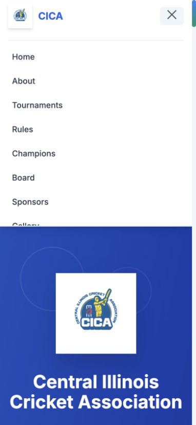
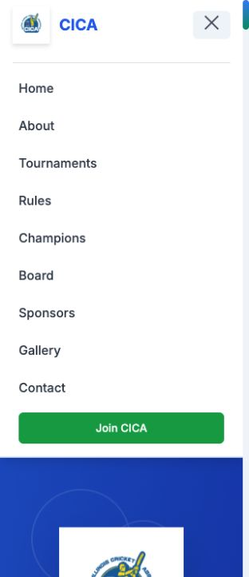

# UI verification

Chrome screenshots captured October 7, 2026. Before: published prototype at a 390px viewport. After: consolidated static site at a narrower 320px viewport. The complete mobile menu and join action remain available after the fix.

The after screenshot is a local build preview, not proof of production deployment. Contact required-field validation, admin notice and narrow Rules buttons were checked separately in Chrome.
