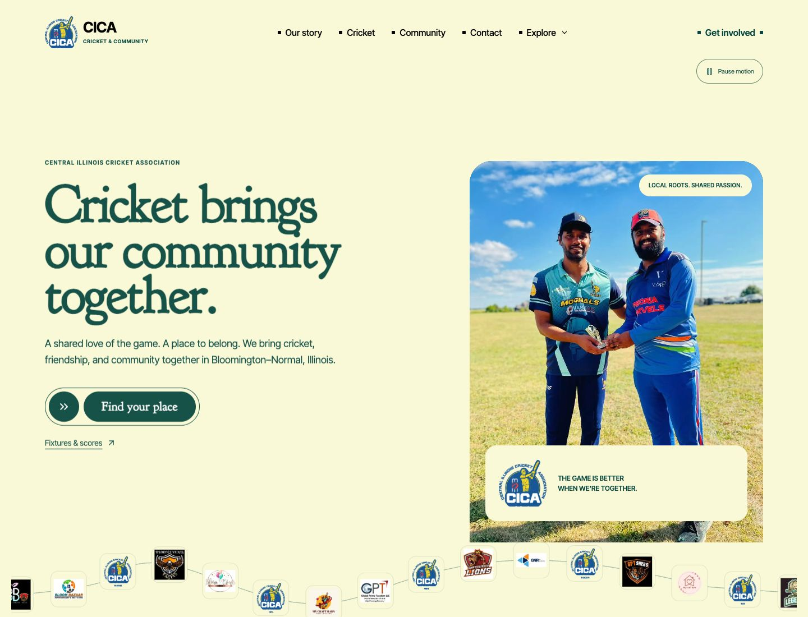
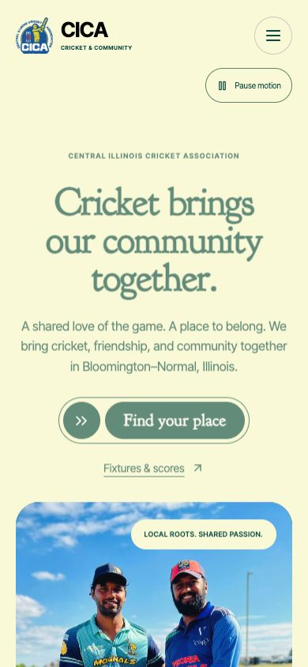
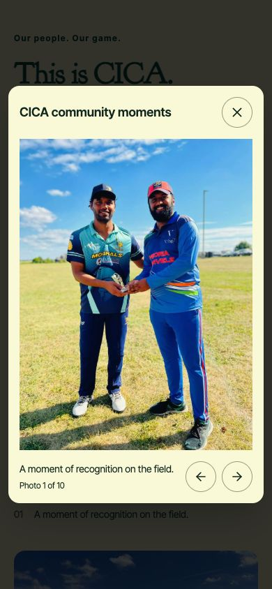
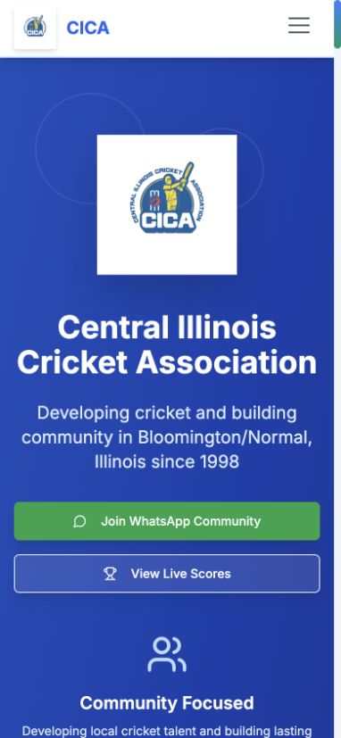
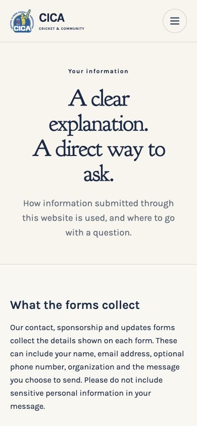
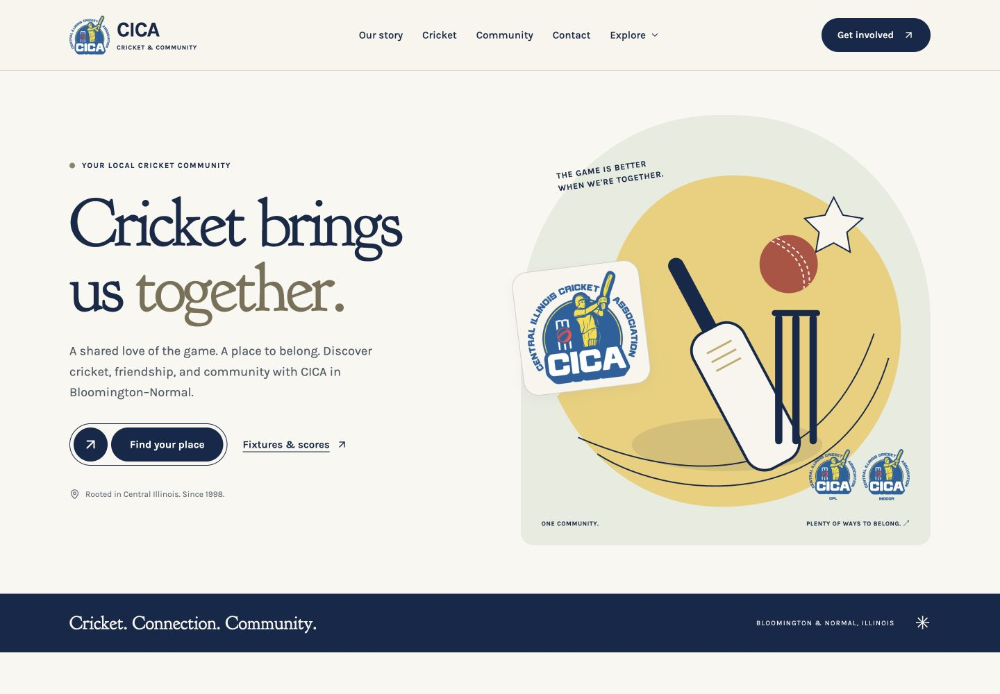

# UI verification

## Growlio photography and motion revision, October 7, 2026

The current preview uses authentic CICA photographs, bold cream/green typography,
a moving curved ribbon of CICA, team and sponsor identities, a prominent sponsor
spotlight, and a larger dark story/footer composition.

Chrome checked twelve public content routes at 320, 768 and 1100px, with no
horizontal overflow or clipped main headings after repairing the sponsor strip
at the desktop breakpoint. Home was also checked at 1440px. Actual SVG logo
movement and stable position after Pause were verified. The pause choice persists
across client navigation; paused entrance effects leave all text fully visible.
Mobile navigation, sponsor selection, gallery next/arrow navigation, Escape
dismissal and thumbnail focus restoration were checked in Chrome.

Four additional unit tests verify pause/resume, initial reduced-motion preference,
runtime preference changes, and hover/keyboard interaction stopping sponsor timers.
There are 37 passing Jest checks, plus TypeScript, lint, static export, three
deployment regressions and two built-admin security checks. Reduced motion is
covered in source and unit tests, not by changing the Mac's system preference.
Physical iOS/Android performance, screen readers and Core Web Vitals are not certified.

## Initial premium design, superseded by the revision above

Before and after use a matching 390px viewport. The before image is the live
baseline `c2abb0f`; the after image is the local production export.

Chrome checks covered all twelve public content routes at effective widths of
320, 768 and 1100px: no horizontal overflow, one main heading per page and no
failed loaded images. Mobile navigation opened, closed on Escape and restored
focus. Unit tests cover accessible validation and submission states. CSS disables
decorative animation under reduced motion. These checks are not a screen-reader,
contrast or Core Web Vitals certification; physical device testing remains useful.

## Earlier launch fixes

Chrome screenshots captured October 7, 2026. Before: published prototype at a 390px viewport. After: consolidated static site at a narrower 320px viewport. The complete mobile menu and join action remain available after the fix.

The after screenshot is a local build preview, not proof of production deployment. Contact required-field validation, admin notice and narrow Rules buttons were checked separately in Chrome.
